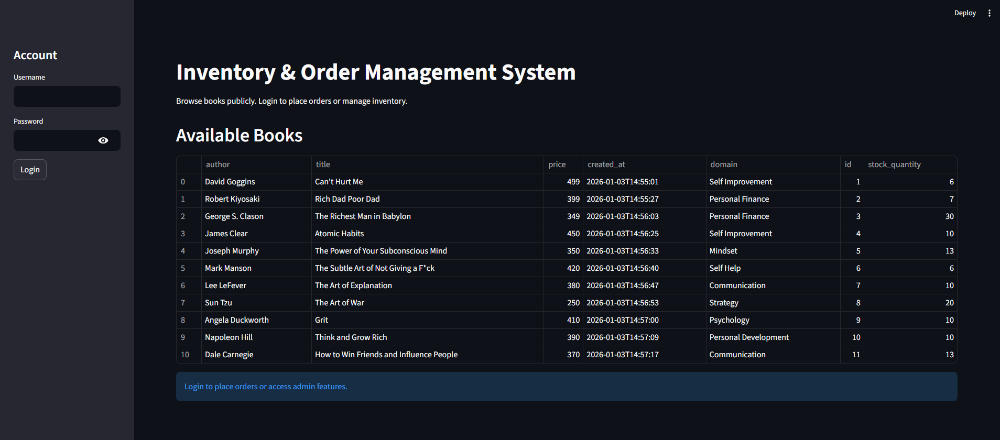
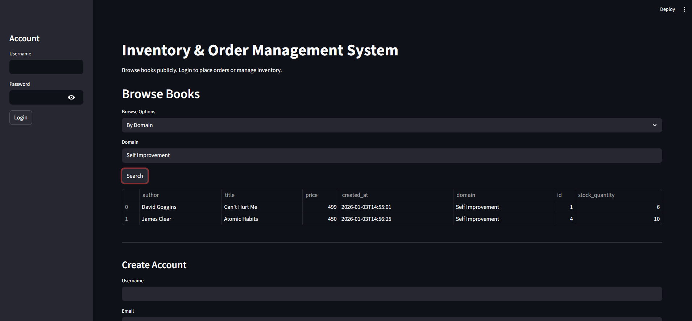
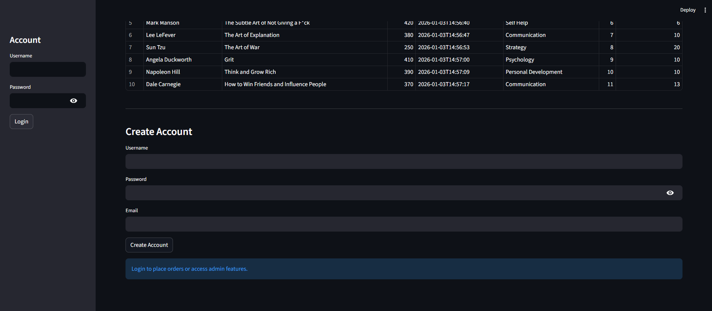
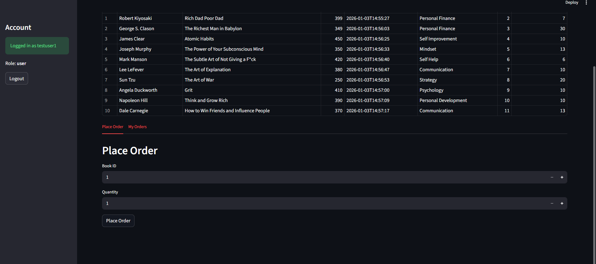
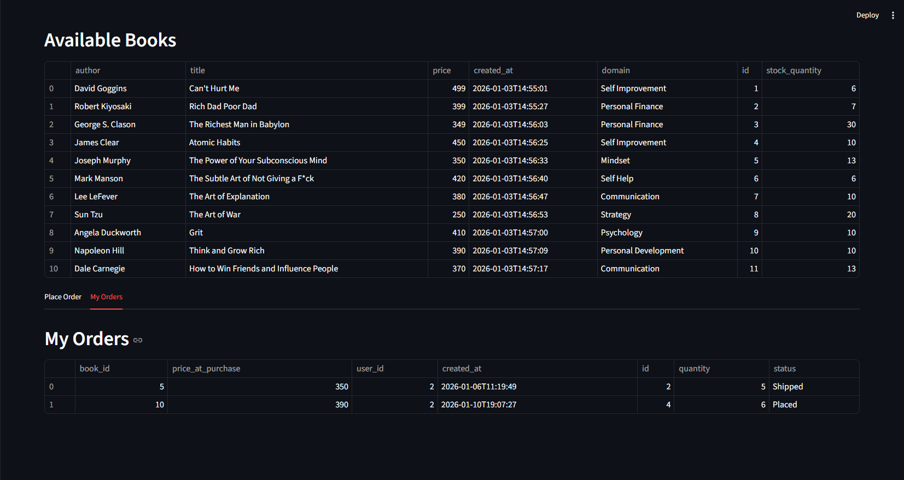
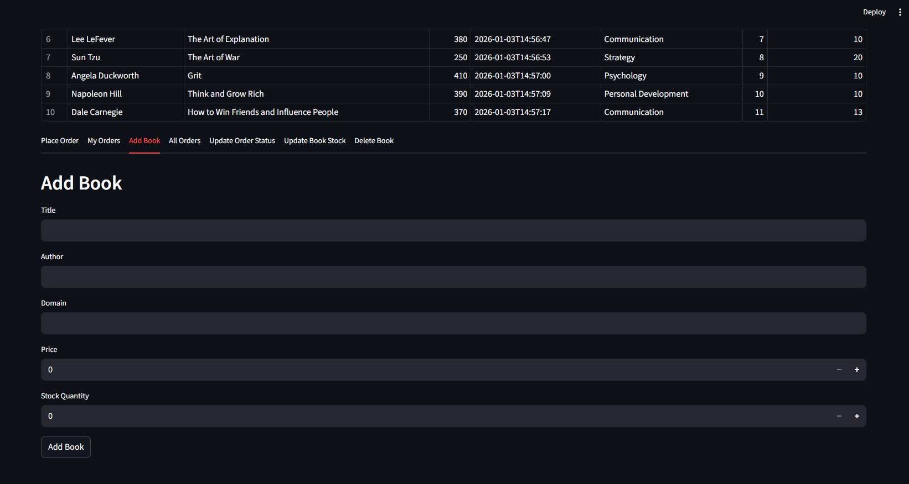
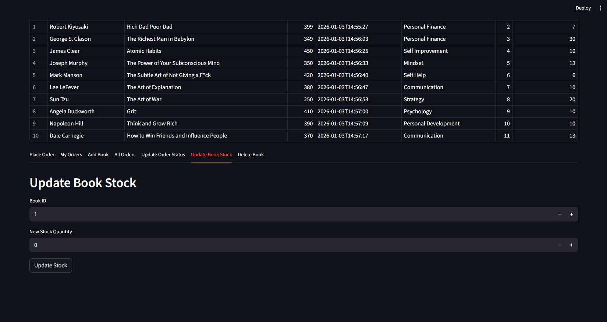
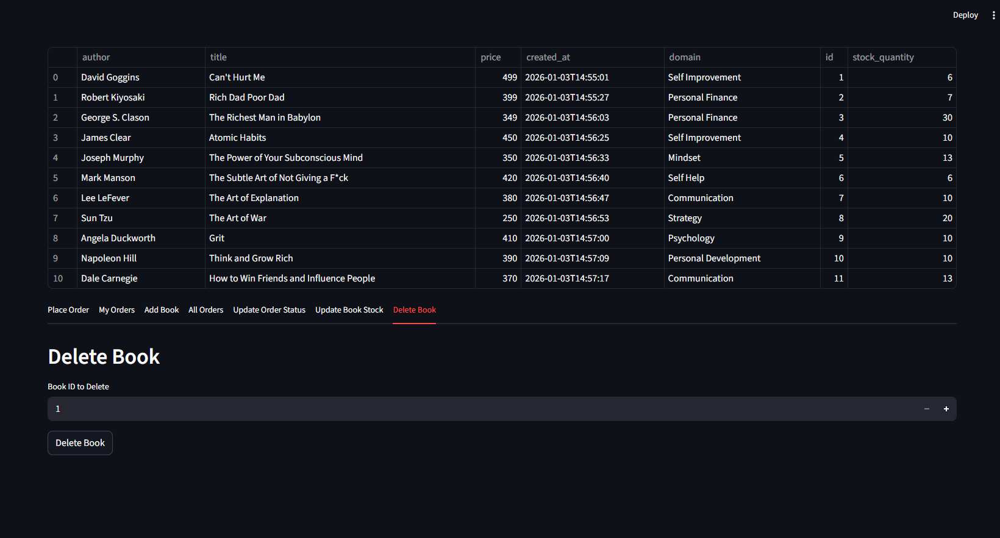
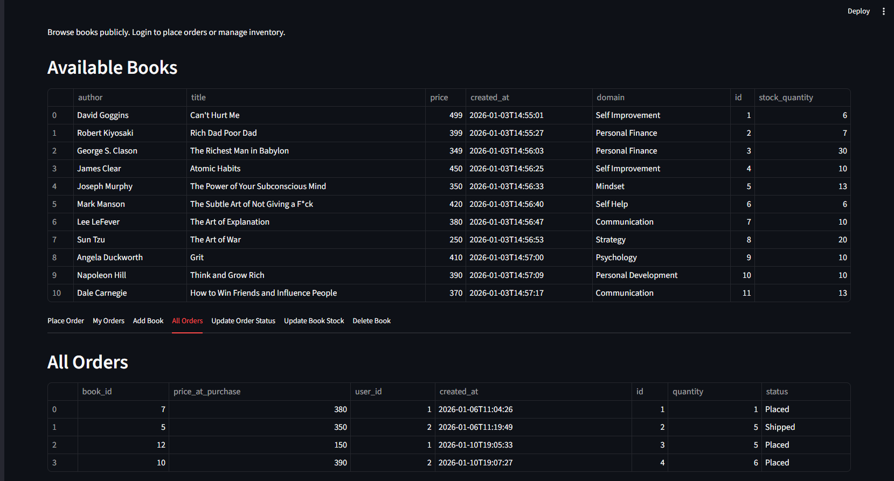

# Inventory & Order Management System

A full-stack inventory and order management system built with **FastAPI** and **SQLAlchemy**, featuring **JWT-based authentication**, **role-based access control**, and a **transactional order workflow**. The system supports public browsing, secure order placement, inventory management, and admin-controlled order lifecycle operations. A lightweight **Streamlit frontend** demonstrates end-to-end functionality.

---

## Features

### Public
- Browse all books
- Search books by ID
- Filter books by domain
- Filter books by domain and budget

### User
- User registration and login
- JWT-based authentication
- View profile details
- Place orders
- View personal order history

### Admin
- Add new books to inventory
- Update book stock quantity
- Delete books
- View all orders
- Update order status (Placed → Confirmed → Shipped → Delivered / Cancelled)

---

## Tech Stack

**Backend**
- FastAPI
- SQLAlchemy
- Alembic
- SQLite (development) / PostgreSQL (production-ready)
- JWT Authentication (OAuth2)

**Frontend**
- Streamlit
- Requests

**Tools**
- Git & GitHub

---

## Project Structure
inventory-order-management-system/
├── backend/
│ ├── main.py
│ ├── models.py
│ ├── database.py
│ ├── routers/
│ │ ├── __init__.py
│ │ ├── auth.py
│ │ ├── public.py
│ │ ├── orders.py
│ │ └── admin.py
│ ├── schemas/
│ │ ├── __init__.py
│ │ ├── book.py
│ │ ├── user.py
│ └── alembic/
├── frontend/
│ └── app.py
├── screenshots/
├── README.md
├── venv/
├── requirements.txt
└── LICENSE

## Screenshots

### Home Page & Public Book Browsing

### Filter Books (Domain / Budget)

### Create User

### User Login

### Place Order

### My Orders

### Admin – Add Book

### Admin – Update Book Stock

### Admin – Delete Book

### Admin – View All Orders

---

### Authentication
- `POST /create-user`
- `POST /login`
- `GET /get-details`

### Public Books
- `GET /public/`
- `GET /public/{book_id}`
- `GET /public/search/?domain=`
- `GET /public/domain/{domain}?max_price=`

### Orders
- `POST /orders/`
- `GET /orders/get-my-orders`

### Admin
- `POST /admin/`
- `PATCH /admin/{book_id}`
- `DELETE /admin/{book_id}`
- `GET /admin/get-all-orders`
- `PATCH /admin/orders/{order_id}/status`

---

### Run Project

**Backend Setup**
1️. Create Virtual Environment

Windows:
cd backend
python -m venv venv
venv\Scripts\activate

macOS / Linux:
cd backend
python3 -m venv venv
source venv/bin/activate

2️. Install Dependencies:
pip install -r requirements.txt

3️. Run Database Migrations (if applicable):
alembic upgrade head

4️. Start Backend Server:
uvicorn main:app --reload

Backend will be available at:
http://localhost:8000

Swagger Docs:
http://localhost:8000/docs

*** Frontend Setup (Streamlit) ***
Open another terminal and run: 
streamlit run app.py

### How to use my application:
1. Start the backend server
2. Start the Streamlit frontend
3. Browse books publicly
4. Create an account and log in
5. Place orders as a user
6. Manage inventory and orders as admin

